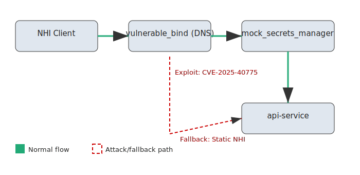
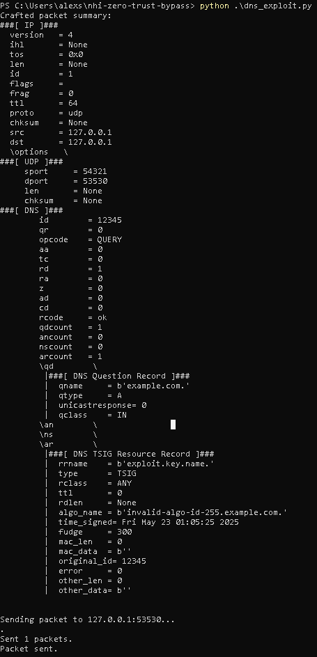
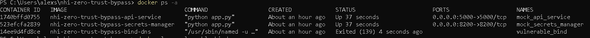
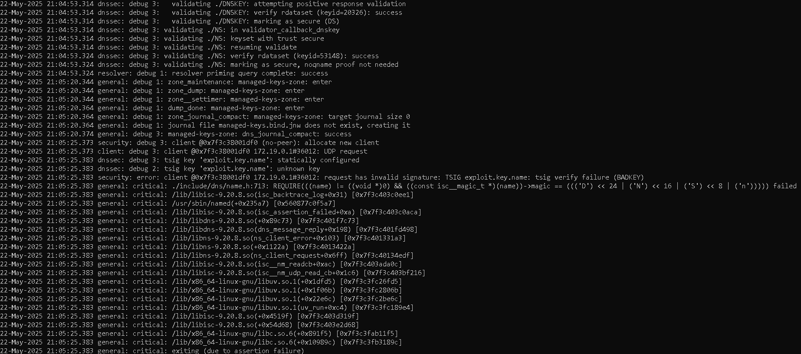
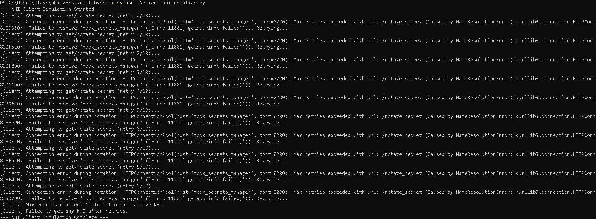
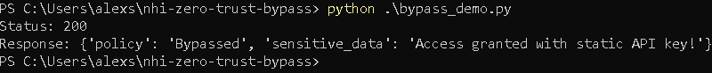

# Project: Exploiting Protocol Vulnerabilities to Manipulate NHI Secrets and Bypass Zero-Trust Policies



## Screenshots

Below are real screenshots from the demonstration. For more, see [screenshots/README.md](screenshots/README.md).

### 1. DNS Exploit (BIND Crash)

**A. Exploit Packet Sent**


*Scapy sends a malformed TSIG DNS packet to BIND (see `dns_exploit.py`).*

**B. Container Crash Confirmed**


*`docker ps -a` shows the BIND container has exited after the exploit.*

**C. Crash Log Evidence**


*Relevant assertion failure and crash log from `docker logs vulnerable_bind`.*

### 2. NHI Secret Rotation Failure


*NHI client (`client_nhi_rotation.py`) fails to rotate secret due to DNS outage, falls back to static credential.*

### 3. Zero-Trust Bypass


*Bypass demonstration (`bypass_demo.py`): static credential is accepted by the protected API, bypassing zero-trust controls.*

---

## Objective
Demonstrate how an attacker could exploit a critical DNS vulnerability (CVE-2025-40775) to crash DNS servers, disrupt Non-Human Identity (NHI) secret rotation workflows, and hijack machine identities—thereby bypassing zero-trust security frameworks. This project focuses on protocol-level vulnerabilities and NHI lifecycle gaps, avoiding AI/ML dependencies.

## Background & Relevance
1.  **DNS Vulnerabilities:** Exploration of critical DNS vulnerabilities (e.g., BIND DoS via malformed TSIG records).
2.  **NHI Management:** Analysis of common weaknesses in the management and lifecycle of non-human identities (API keys, service accounts, machine identities) in cloud environments.
3.  **Zero-Trust Frameworks:** Understanding how zero-trust principles rely on continuous authentication and secret rotation, and how disruption can invalidate these assumptions.

## Attack Chain Workflow

### Phase 1: Trigger DNS Server Crash
* **Goal:** Disrupt DNS resolution for target cloud services.
* **Method:** Craft malformed DNS queries exploiting a known BIND vulnerability related to TSIG records (CVE-2025-40775).
* **Tool:** `Scapy` for packet generation.

### Phase 2: Exploit NHI Secret Rotation Failures
* **Goal:** Force systems to rely on static/fallback NHIs and capture them.
* **Method:** Disrupt communication with secrets managers (e.g., HashiCorp Vault) via DNS DoS, causing secret rotation retries. Investigate if plaintext fallback secrets are transmitted during these retries, or if reliance on stale secrets creates an opportunity.
* **Tool:** `tcpdump` for network capture, Python client simulation.

### Phase 3: Bypass Zero-Trust Policies
* **Goal:** Use stolen/exposed NHIs to impersonate services and exfiltrate data.
* **Method:** Forge authentication tokens (e.g., JWTs) or directly use API keys to access restricted resources.
* **Tool:** Python script to access protected API endpoint.

## Demonstration Summary
1. **Exploit BIND 9.20.8 with a malformed TSIG DNS packet** (using `dns_exploit.py` and Scapy) to crash the DNS server.
2. **Observe NHI secret rotation failures** in the client (`client_nhi_rotation.py`) due to DNS outage, leading to fallback on a static/break-glass credential.
3. **Demonstrate zero-trust bypass** by using the static credential (`STATIC_BREAK_GLASS_KEY_XYZABC`) to access the protected API (`bypass_demo.py`), which grants access and bypasses policy.

## Key Files
- `dns_exploit.py`: Scapy script to trigger BIND DoS.
- `client_nhi_rotation.py`: Simulates NHI secret rotation and fallback.
- `bypass_demo.py`: Demonstrates bypass using static NHI.
- `api-service-mock/app.py`: Protected API endpoint.
- `secrets-manager-mock/app.py`: Simulated secrets manager.
- `docker-compose.yml`: Orchestrates the environment.

## How to Run
1. Build and start the environment:
   ```powershell
   docker-compose up -d --build
   ```
2. Run the DNS exploit:
   ```powershell
   python .\dns_exploit.py
   ```
3. Run the NHI client simulation:
   ```powershell
   python .\client_nhi_rotation.py
   ```
4. Run the bypass demonstration:
   ```powershell
   python .\bypass_demo.py
   ```

## Impact
- **End-to-end exploit chain**: DNS DoS → NHI rotation failure → static credential exposure → zero-trust bypass.
- **Realistic cloud-native scenario**: Demonstrates how protocol-layer attacks can undermine modern security frameworks.

## Recommendations
- Eliminate static/break-glass credentials wherever possible.
- Harden DNS infrastructure and monitor for protocol anomalies.
- Ensure secrets managers and clients degrade securely under infrastructure failures.

## Vulnerability Disclosure

This project demonstrates the impact of [CVE-2025-40775](https://kb.isc.org/docs/cve-2025-40775), a denial-of-service vulnerability in BIND 9.20.0–9.20.8. The lab intentionally builds and runs BIND 9.20.8 to simulate this scenario. All testing was performed in a controlled environment for research and educational purposes only.

## CVE Details

- **CVE:** [CVE-2025-40775](https://nvd.nist.gov/vuln/detail/CVE-2025-40775)
- **Description:** When an incoming DNS protocol message includes a Transaction Signature (TSIG), BIND always checks it. If the TSIG contains an invalid value in the algorithm field, BIND immediately aborts with an assertion failure.
- **Affected Versions:** 9.20.0–9.20.8, 9.21.0–9.21.7
- **Impact:** Remote, unauthenticated DoS (CVSS 7.5 HIGH)
- **Workaround:** None. Patch to 9.20.9 or later.
- **References:** [ISC Advisory](https://kb.isc.org/docs/cve-2025-40775), [NVD](https://nvd.nist.gov/vuln/detail/CVE-2025-40775)
- **CWE:** [CWE-232: Improper Handling of Undefined Values](https://cwe.mitre.org/data/definitions/232.html)

## How the Vulnerable Version is Used

The `vulnerable_bind` service is built from source using the official 9.20.8 tarball, as shown in the [Dockerfile](docker/bind-vulnerable-build/Dockerfile). This is for demonstration only—**do not use this version in production.**

## Disclaimer

This repository is for educational and research purposes only. Do not use these techniques or code for unauthorized or malicious activities. See [DISCLAIMER.md](DISCLAIMER.md).