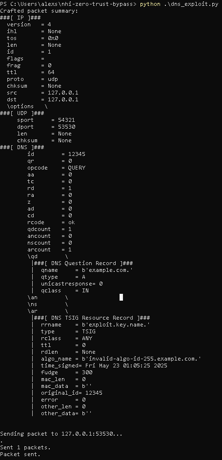
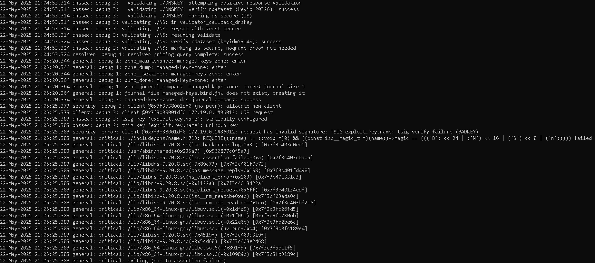
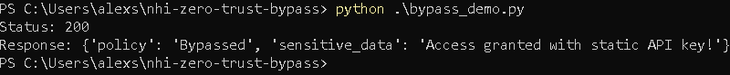

# Exploit and Bypass Screenshots

This directory contains screenshots referenced in the main [README.md](../README.md) to demonstrate the exploit and bypass steps from this lab. For each step, see the images below:

---

## 1. DNS Exploit (BIND Crash)
**A. Exploit Packet Sent**  

**B. Container Crash Confirmed**  

**C. Crash Log Evidence**  

---

## 2. NHI Secret Rotation Failure

---

## 3. Zero-Trust Bypass

---